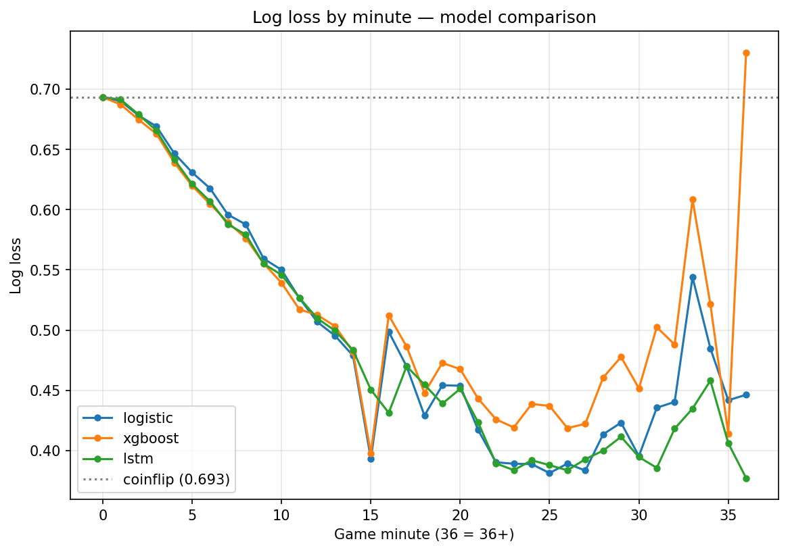

# LoL Win Probability: Does Game History Matter?

A win-probability model for high-elo League of Legends games, built to test a specific research question: **does the sequence of how a game unfolded carry predictive information beyond the current game state?** The project compares snapshot models (logistic regression, gradient boosting) against a sequence model (LSTM) on identical data, with an emphasis on probability calibration rather than raw accuracy.

---

## Motivation

As a long-time fan of League of Legends esports, I've always been drawn to the live win-probability readout that broadcasts overlay on each game — a single number that tells the audience, at a glance, where the match stands. I wanted to build my own version, but with a deeper question attached than "can I predict the winner": **does the *trajectory* of a game carry predictive information beyond its current state, or is the present snapshot already enough?**

To answer that, I framed it as a direct comparison rather than a single model. Two snapshot baselines — logistic regression and XGBoost — predict from the current game state alone. An LSTM sequence model reads the entire game frame by frame. If the LSTM meaningfully beats the baselines, game history matters and the process is path-dependent; if it doesn't, the current state is approximately a sufficient statistic and the game behaves as a near-Markov process. Either outcome is a real answer.

---

## Overview

The pipeline collects high-elo Korean-server ranked games via Riot's API, engineers per-minute team-difference features from match timelines, and trains three model families to predict win probability at every point in a game:

- A **logistic regression** baseline (interpretable, linear)
- A **gradient-boosted** model (XGBoost — captures non-linear interactions)
- An **LSTM** sequence model (reads the full game trajectory frame by frame)

All three are evaluated on the same held-out matches using log loss, accuracy, per-minute performance curves, and calibration (reliability) diagrams. The central comparison is whether the sequence model outperforms the snapshot baselines — and where in a game any difference emerges.

The project is organized into five stages: data ingestion, feature engineering, baseline models, evaluation, and the LSTM.

---

## Data

- **Source:** Riot Games `match-v5` API (match detail + timeline endpoints), Korean server.
- **Population:** Challenger + Grandmaster solo-queue players (seeded from the `league-v4` leaderboard, then expanded by snowball sampling through match participants).
- **Size:** 4,861 matches → 128,699 per-minute frames.
- **Unit of observation:** one team's aggregated game state at one minute, expressed as **team-100-minus-team-200 differences** (gold, XP, level, CS, and cumulative objectives: towers, dragons, barons, heralds, void grubs). Differences are used because the *gap* between teams — not absolute totals — is what predicts winning, and this framing also halves the problem (team 200's perspective is just the negation).
- **Label:** whether team 100 won (constant per game; the model predicts it from progressively more information as the game develops).
- **Patch scope:** current-season patches (predominantly 16.13–16.14) to avoid mixing balance eras.

Timeline frames are emitted roughly once per minute. Economy/farm features are read directly from each frame's snapshot; objective features are accumulated by parsing the event log up to each frame (with careful attention to team attribution — e.g. `BUILDING_KILL` reports the *victim* team, not the destroyer).

Raw JSON is cached locally and is not committed to the repository; all data is reproducible from the ingestion code.

---

## Methodology

**Feature engineering.** Each timeline is collapsed from 10 individual players to 2 teams, then to a single per-minute difference vector. Objective counts are cumulative running diffs. `minute` is retained as a feature so models can contextualize a given lead by game phase.

**Train/test split — by match, not by row.** Frames from the same game are highly correlated and share a label, so a naive row-level split would leak game outcomes across train and test and inflate results. All frames from a given match are therefore assigned entirely to train or entirely to test (80/20). The LSTM additionally carves a validation set from the training matches (final split 64/16/20), reusing the *identical* test matches as the baselines so all comparisons are like-for-like.

**Baselines.** Logistic regression (with feature standardization, since features span very different scales) and XGBoost (scale-invariant, so no standardization). The fitted scaler is saved and reused everywhere downstream so every model sees identically-scaled inputs.

**LSTM.** Flat features are reshaped into padded sequences of shape `(games, 38, features)`, where 38 is the 95th-percentile game length; shorter games are zero-padded and longer ones truncated. A **mask** marks real vs padded frames. The network (single LSTM layer, hidden size 64, dropout 0.3, unidirectional to avoid using future information) emits a win logit at **every** frame (many-to-many), matching the baselines' per-frame granularity. Training uses a **masked binary-cross-entropy loss** that ignores padded frames entirely, the Adam optimizer, and early stopping on validation loss.

**Evaluation.** Every model flows through the same evaluation suite on the same test matches:
- **Log loss** (primary — grades probability quality, punishing confident errors) and accuracy
- **Per-minute curves** — performance bucketed by game minute, since a single pooled number hides that early-game prediction is near-coinflip and late-game is near-certain
- **Calibration / reliability diagrams** — whether a predicted "70%" actually wins ~70% of the time

Calibration is treated as a first-class metric because the deliverable is a *probability*, not just a classification, and an uncalibrated probability is not trustworthy regardless of accuracy.

---

## Results

The headline finding is that the sequence model does **not** outperform the simple linear baseline at any stage of the game — evidence that a LoL game's current state is a near-sufficient statistic for its outcome.

### Headline metrics (identical held-out test set)

| Model | Log Loss | Accuracy |
|---|---|---|
| Logistic Regression | 0.520 | 0.719 |
| XGBoost | 0.532 | 0.714 |
| LSTM | 0.518 | 0.717 |

The LSTM and logistic regression are effectively tied on log loss (a 0.002 gap, within run-to-run training noise), and all three are close on accuracy.

### Log loss by minute



1. **LSTM ≈ logistic regression across all game phases.** Sequence information adds no meaningful predictive power over the current game state, implying the game is approximately Markovian — a simple logistic regression is sufficient, and the added complexity of a sequence model is not justified by these features.
2. **XGBoost degrades in the mid-to-late game**, rising above both other models from roughly minute 20 onward and spiking sharply in the sparse 36+ tail — a signature of overfitting to the small amount of late-game data.
3. **All three models start at 0.693 at minute 0** (the coinflip baseline, since nothing has happened yet), fall to ~0.38–0.40 by minute ~23, and rise in the tail. The late-game rise reflects both small sample size and a selection effect: games that run long are disproportionately the genuinely close ones.

All three models are well-calibrated, with near-diagonal reliability diagrams — meaning a predicted "70%" corresponds to an actual ~70% win rate. This matters because the deliverable is a probability, and calibration is what makes that probability trustworthy.

### Feature importance

`gold_diff` dominates by a wide margin — a result both models agree on independently (importance 0.586 in XGBoost; the largest standardized coefficient, +1.33, in logistic regression).

| Feature | XGBoost Importance |
|---|---|
| gold_diff | 0.586 |
| level_diff | 0.074 |
| xp_diff | 0.072 |
| dragon_diff | 0.061 |
| herald_diff | 0.038 |
| baron_diff | 0.036 |
| grub_diff | 0.034 |
| minute | 0.034 |
| tower_diff | 0.034 |
| cs_diff | 0.031 |

### Blue/red side asymmetry (a data-level insight)

Mean of each objective difference (team 100 − team 200) across all frames:

| Objective | Mean diff |
|---|---|
| tower_diff | +0.052 |
| dragon_diff | −0.229 |
| baron_diff | −0.004 |
| herald_diff | +0.065 |
| grub_diff | +0.365 |

Dragons skew toward red side and void grubs toward blue side — opposite skews that align with map geometry, since the dragon pit sits in the bottom river (nearer red's side) and grubs spawn in the top river (nearer blue's). Baron, more neutrally positioned and contested later, shows essentially no skew.

---

## Limitations

- **The "history adds nothing" finding is conditional on the feature set.** The cumulative difference features already encode trajectory implicitly — a gold *lead* is itself a summary of what happened earlier — so the LSTM may have had little left to extract. A richer, less-aggregated feature set (raw per-frame events, champion positions) might give a sequence model more to work with. The honest claim is "with these features, history adds nothing," not "history never matters in LoL."
- **Late-game buckets are sparse and noisy.** Few games run past ~35 minutes, and those that do are subject to a selection effect (long games are the genuinely close ones), so the tail of the per-minute curves is less reliable than the mid-game.
- **Korean high-elo only.** Results may not generalize to other regions, skill tiers, or patches.
- **Some objective coefficients are negative** (e.g. `tower_diff`, `baron_diff`) in the logistic model. This is a multicollinearity artifact — `gold_diff` already absorbs the value of those objectives — not a claim that taking towers or barons is bad.

---

## Project Structure

```
lol-win-probability/
├── src/
│   ├── data_ingestion.py          # Riot API crawl, snowball sampling, caching, manifest
│   ├── feature_engineering.py     # timeline JSON -> per-minute difference features
│   └── models/
│       ├── baseline.py            # logistic regression + XGBoost, match-level split
│       ├── evaluate.py            # log loss, by-minute curves, calibration, comparison
│       ├── sequence_data.py       # reshape to padded sequences + mask, splits
│       ├── lstm_model.py          # the LSTM network definition
│       └── train_lstm.py          # training loop, masked loss, LSTM evaluation
├── notebooks/                     # exploration only
├── reports/figures/               # generated plots
└── requirements.txt
```

Pipeline order: `data_ingestion` → `feature_engineering` → `models/baseline` → `models/evaluate` → `models/sequence_data` → `models/train_lstm`.

---

## Setup

**Requirements:** Python 3.9+, a Riot API key (free development key from [developer.riotgames.com](https://developer.riotgames.com); note the dev key expires every 24 hours).

```bash
# Clone and enter
git clone https://github.com/benjamincheng18/lol-win-probability.git
cd lol-win-probability

# Virtual environment
python3 -m venv venv
source venv/bin/activate
pip install -r requirements.txt

# API key
echo "RIOT_API_KEY=your_key_here" > .env
```

**Running the pipeline:**

```bash
# 1. Collect matches (long-running; resumes from checkpoint if interrupted)
python -m src.data_ingestion

# 2. Build the feature table
python -m src.feature_engineering

# 3. Train baselines (logistic + XGBoost)
python -m src.models.baseline

# 4. Evaluate baselines (metrics + plots)
python -m src.models.evaluate

# 5. Train + evaluate the LSTM
python -m src.models.train_lstm
```

Outputs (models, scaler, split indices, plots) are written under `data/processed/` and `reports/figures/`. Raw match data and processed features are gitignored and regenerated by the pipeline.

---

## Tech Stack

Python · pandas · NumPy · scikit-learn · XGBoost · PyTorch · matplotlib